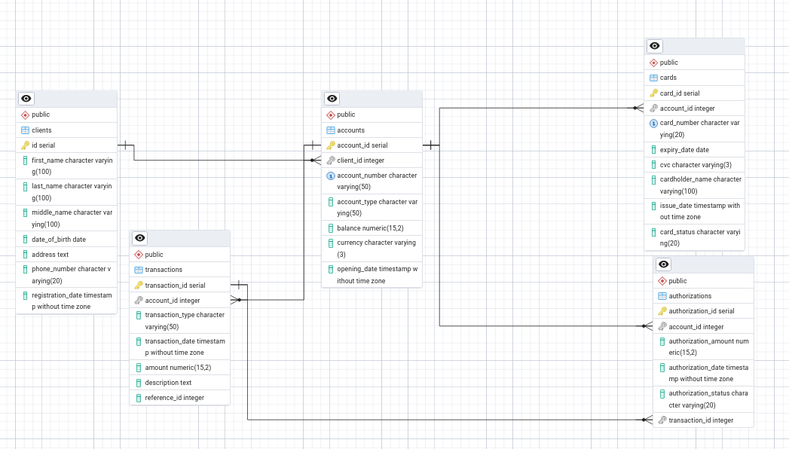

# Структура базы данных

База данных состоит из пяти основных сущностей: 
- `clients` (Клиенты);
- `accounts` (Счета);
- `cards` (Карты);
- `transactions` (Транзакции);
- `authorization` (Авторизации).

## Клиенты (Clients)

Таблица `Clients` хранит информацию о клиентах банка.

* **id** (`INTEGER`, `PRIMARY KEY`, `SERIAL`) - уникальный идентификатор клиента;
* **first_name** (`VARCHAR(100)`, `NOT NULL`) - имя клиента;
* **last_name** (`VARCHAR(100)`, `NOT NULL`) - фамилия клиента;
* **middle_name** (`VARCHAR(100)`) - отчество клиента (может отсутствовать);
* **date_of_birth** (`DATE`) - дата рождения клиента;
* **address** (`TEXT`) - адрес клиента;
* **phone_number** (`VARCHAR(20)`) - номер телефона клиента;
* **registration_date** (`TIMESTAMP WITHOUT TIME ZONE`, `DEFAULT CURRENT_TIMESTAMP`) - дата и время регистрации клиента в системе.

## Счета (Accounts)

Таблица `Accounts` хранит информацию о банковских счетах клиентов.

* **account_id** (`INTEGER`, `PRIMARY KEY`, `SERIAL`) -  уникальный идентификатор счета;
* **client_id** (`INTEGER`, `NOT NULL`, `FOREIGN KEY REFERENCES Clients(id) ON DELETE CASCADE`) - идентификатор клиента - владельца счета. Связь с таблицей `Clients`. При удалении клиента удаляются все его счета;
* **account_number** (`VARCHAR(50)`, `UNIQUE`, `NOT NULL`)- уникальный номер счета;
* **account_type** (`VARCHAR(50)`, `NOT NULL`) - тип счета (to be done);
* **balance** (`DECIMAL(15, 2)`, `NOT NULL`, `DEFAULT 0.00`) - текущий баланс счета. Хранит только два числа после точки;
* **currency** (`VARCHAR(3)`, `NOT NULL`) - валюта счета (KZT, USD и пр.);
* **opening_date** (`TIMESTAMP WITHOUT TIME ZONE`, `DEFAULT CURRENT_TIMESTAMP`) - дата и время открытия счета.

## Карты (Cards)

Таблица `Cards` хранит информацию о банковских картах, привязанных к счетам.

* **card_id** (`INTEGER`, `PRIMARY KEY`, `SERIAL`) - уникальный идентификатор карты;
* **account_id** (`INTEGER`, `NOT NULL`, `FOREIGN KEY REFERENCES Accounts(account_id) ON DELETE CASCADE`) - идентификатор счета, к которому привязана карта. Связь с таблицей `Accounts`. При удалении счета удаляются все связанные с ним карты;
* **card_number** (`VARCHAR(20)`, `UNIQUE`, `NOT NULL`)- уникальный номер карты;
* **expiry_date** (`DATE`, `NOT NULL`) - дата окончания срока действия карты;
* **cvc** (`VARCHAR(4)`, `NOT NULL`) - CVC/CVV код карты.
* **cardholder_name** (`VARCHAR(100)`, `NOT NULL`) - имя держателя карты, как указано на карте;
* **issue_date** (`TIMESTAMP WITHOUT TIME ZONE`, `DEFAULT CURRENT_TIMESTAMP`) - дата выпуска карты.
* **card_status** (`VARCHAR(20)`, `NOT NULL`, `DEFAULT 'active'`) - статус карты (например, active, inactive, blocked).

## Транзакции (Transactions)

Таблица `Transactions` хранит информацию о финансовых транзакциях по счетам.

* **transaction_id** (`INTEGER`, `PRIMARY KEY`, `SERIAL`)- уникальный идентификатор транзакции;
* **account_id** (`INTEGER`, `NOT NULL`, `FOREIGN KEY REFERENCES Accounts(account_id) ON DELETE RESTRICT`)- идентификатор счета, по которому прошла транзакция. Связь с таблицей `Accounts`. Удаление счета запрещено, если существуют связанные транзакции;
* **transaction_type** (`VARCHAR(50)`, `NOT NULL`) - тип транзакции (например, deposit, withdrawal, transfer, payment);
* **transaction_date** (`TIMESTAMP WITHOUT TIME ZONE`, `DEFAULT CURRENT_TIMESTAMP`) - дата и время транзакции;
* **amount** (`DECIMAL(15, 2)`, `NOT NULL`) - сумма транзакции. Хранит только два числа после точки;
* **description** (`TEXT`) - описание транзакции;
* **reference_id** (`INTEGER`) - идентификатор связанной транзакции (например, при переводе средств);

## Авторизации (Authorizations)

Таблица `Authorizations` хранит информацию о запросах на авторизацию средств (блокировке).

* **authorization_id** (`INTEGER`, `PRIMARY KEY`, `SERIAL`)- уникальный идентификатор авторизации;
* **account_id** (`INTEGER`, `NOT NULL`, `FOREIGN KEY REFERENCES Accounts(account_id) ON DELETE RESTRICT`)- идентификатор счета, на котором заблокированы средства. Связь с таблицей `Accounts`. Удаление счета запрещено, если существуют активные авторизации;
* **authorization_amount** (`DECIMAL(15, 2)`, `NOT NULL`) - сумма заблокированных средств. Хранит только два числа после точки;
* **authorization_date** (`TIMESTAMP WITHOUT TIME ZONE`, `DEFAULT CURRENT_TIMESTAMP`) - дата и время запроса на авторизацию;
* **authorization_status** (`VARCHAR(20)`, `NOT NULL`, `DEFAULT 'pending'`) - статус авторизации (например, pending, captured, cancelled).
* **transaction_id** (`INTEGER`, `FOREIGN KEY REFERENCES Transactions(transaction_id) ON DELETE SET NULL`) - идентификатор транзакции списания после успешной авторизации. Связь с таблицей `Transactions`. При удалении связанной транзакции значение становится NULL.

# ERD-схема

